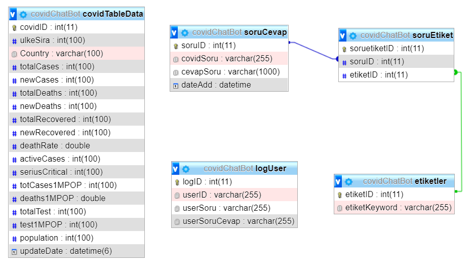

# COVID SANAL ASİSTAN

<h4>Bu proje, Türkçe Doğal Dil İşleme Online Yarışması AçıkHack2 kapsamında GuruTeam tarafından hazırlanmıştır.</h4>

# ÖZET
Bu projede, günümüzün güncel problemlerinden biri olan Covid-19 salgını hakkında sıkça sorulan sorulara cevap veren ve dünyadaki ülkelerin Covid-19 ile ilgili toplam vaka sayısı, bugünkü ölüm sayısı, toplam iyileşen sayısı, vb. istatistiklerini sunan bir sanal asistan geliştirilmiştir. Projenin amacı, Covid-19 salgını hakkındaki bilgi kirliliğini önlemek ve salgınla ilgili güncel verileri kolay bir şekilde kullanıcılarla paylaşmaktır.

# COVID SANAL ASİSTAN'IN ÖZELLİKLERİ
  # 1- Sıkça sorulan sorulara cevaplar  
Covid-19 hakkında merak edilen sorulara açık ve anlaşılır cevaplar sunulmaktadır. Kullanıcılar cevabını öğrenmek istediği herhangi bir soruyu farklı şekillerde sorabilir ve cevabını öğrenebilir. Kullanıcının yönelttiği soru cümlesi doğal dil işleme aşamasından geçirildiği için, önemli kelimelerin sırasının farklı olması veya farklı ekler alması doğru cevabın bulunmasına engel olmamaktadır. Örneğin, klimaların Covid-19 virüsü yayılmasındaki etkisini öğrenmek için aşağıdaki sorulardan herhangi biri sorulabilir ve sorular farklı şekillerde sorulmasına rağmen doğru cevap kullanıcıya verilmektedir. 
<ul>
  <li>Kapalı ortamlarda klima kullanmak tehlikeli midir?</li>
  <li>Salgın döneminde klima riskli midir?</li>
  <li>Klima virüsü bulaştırır mı?</li>
  <li>Toplu taşımada klima açılması sakıncalı mıdır?</li>
</ul>  

  
  # 2- Ülkelere dair istatistiksel veriler
Dünyadaki tüm ülkelerdeki Covid-19 salgınının etkisini sayısal verilerle paylaşan "https://www.worldometers.info/coronavirus" sayfası üzerinden çekilen verilere göre kullanıcıya sormuş olduğu ülkeye dair bilgiler sunulmaktadır. Kullanıcıya sunulan veri başlıkları aşağıdaki gibidir: 
 
<ul>
  <li>Toplam vaka sayısı</li>
  <li>Bugünkü vaka sayısı</li>
  <li>Toplam ölüm sayısı</li>
  <li>Bugünkü ölüm sayısı</li>
  <li>Toplam iyileşen sayısı</li>
  <li>Bugünkü iyileşen sayısı</li>
  <li>Ölüm oranı</li>
  <li>Aktif vaka sayısı</li>
  <li>Kritik vaka sayısı</li>
  <li>1 milyondaki vaka sayısı</li>
  <li>1 milyondaki ölüm sayısı</li>
  <li>Toplam test sayısı</li>
  <li>1 milyondaki test sayısı</li>
  <li>Nüfus</li>
</ul> 

Ülkelere dair yukarıda listelenen başlıklardaki veriler aşağıdaki şekilde örnek sorularla öğrenilebilir:
<ul>
  <li>Türkiyede bugünkü vefat sayısı nedir?</li>
  <li>Ülkemizdeki bugünkü vaka sayısı nedir?</li>
  <li>Almanya'daki toplam ölüm oranı nedir?</li>
  <li>Singapur'daki test sayısını öğrenebilir miyim?</li>
  <li>Hırvatistan'daki toplam iyileşen sayısı nedir?</li>
  <li>Tayland'ın 1 milyondaki ölüm sayısı nedir?</li>
  <li>Singapur'daki test sayısını öğrenebilir miyim?</li>
</ul> 

Ayrıca, Covid Sanal Asistan kullanıcıların dünya genelindeki Covi-19'a dair sayısal verilerin en yüksek, en düşük gibi sorgulamalarına da cevap verebilmektedir. Aşağıdaki sorular buna örnek olarak veirlebilir:
<ul>
  <li>Dünyadaki en yüksek vaka sayısı nedir?</li>
  <li>Dünyadaki en düşük ölüm oranını öğrenebilir miyim?</li>
  <li>En yüksek test sayısını söyler misin?</li>
  <li>Dünyada Bugünkü en yüksek ölüm sayısı nedir?</li>
  <li>Dünyada en çok vaka sayısı ve en az ölüm oranı nedir?</li>
</ul> 

# METODOLOJİ

 Öncelikle kullanıcının sorduğu soru sırasıyla aşağıdaki önişleme aşamalarından geçirilmektedir.
 <ol>
  <li>Tüm soru cümlesi karakterleri küçük harfe çevrilmektedir.</li>
  <li>Sorudaki noktalama işaretleri silinmektedir.</li>
  <li>Sorunun genel Covid-19 bilgi sorusu mu, ülkelere dair istatistiksel veri sorusu mu olduğu ayırt edilmektedir.</li>
  <li>Soru metni boşluklarına göre kelimelere ayrılmaktadır.</li>
  <li>Soru içinde tek başına bir anlamı olmayan kelimeler (stop words) temizlenmektedir.</li>
  <li>Türkçe doğal dil işleme kütüphanesi olan NZemberek ile kelimelerin gereksiz olan çekim ekleri atılmaktadır.</li>
</ol>
Önişleme adımlarından sonra soru metnindeki kelimeler web servis aracılığıyla veritabanında sorgulanmaktadır. Bu kelimeler, veritabanındaki soruların etiketleri ile karşılaştırılarak en yüksek eşleşme oranı hesaplanmaktadır. Sonuç olarak en yüksek eşleşme oranına sahip sorunun cevabı API aracılığıyla JSON formatında döndürülmektedir.

Projede kullanılan veritabanı Varlık İlişki (Entity Relationship) diyagramı aşağıdaki gibidir:

Veritabanındaki Covid-19 bilgi soruları ve etiketleri PHP ile oluşturulan bir arayüz üzerinden girilmektedir. Öncelikle bir soru cümlesi ve cevabı sisteme girilip, daha sonra bu soruya verilecek olan etiketler ayrıca giriş yapılmaktadır. Daha sonra ilgili soru ve etiketler eşleştirilmektedir.

Covid Sanal Asistan'ın başarısını gözlemlemek, çalışmasını iyileştirmek amacıyla kullanıcıların sormuş olduğu her soru ve sistemin o kullanıcıya verdiği cevap veritabanına kaydedilmektedir. Bu kayıtlar bir arayüz üzerinden listelenmekte ve sanal asistanın kullanımını bu kayıtlar sayesinde gözlemlenmektedir.

# COVİD SANAL ASİSTAN GÖSTERİM

# KULLANILAN TEKNOLOJİLER VE LİSANSLAR

Bu çalışmada Türkçe kelimelerin morfolojik analizi için açık kaynak kodlu Türkçe doğal dil işleme kütüphanesi olan NZemberek kullanılmıştır. Veritabanı MySQL veritabanı motoru kullanılarak oluşturulmuştur ve veriler bu veritabanında tutulmuştur. Projenin arayüzü için ColorLib sitesinden açık kaynak kodlu temalardan biri tercih edilmiştir. Site içerisinde kullanılan görsellerin tamamı ücretsiz olup, söz konusu görseller FreePik sitesinden alınmıştır. Proje .NET platformunda geliştirilmiştir. Kullanılan tüm teknolojilere, araçlara ve materyallere dair lisans bilgileri aşağıdaki gibidir:

NZemberek : https://www.mozilla.org/en-US/MPL/

MySQL : https://www.mysql.com/about/legal/licensing/

Bootsnipp : https://bootsnipp.com/license

.Net FrameWork : https://dotnet.microsoft.com/en/dotnet_library_license.htm

PHP : https://www.php.net/license/3_01.txt

# TAKIM ÜYELERİ

<dl>
  <dt>Murat Karabulut</dt>
  <dd>Takım Kaptanı - mkarabulut44@hotmail.com</dd>
  <dt>Yusuf Uğurlu</dt>
  <dd>Takım Üyesi - yusuf_ugurlu2015@outlook.com</dd>
  <dt>İslam Mayda</dt>
  <dd>Takım Üyesi - islam.mayda@stu.khas.edu.tr</dd>
</dl>

